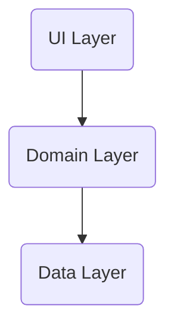

# Marvel

Marvel is a toy project that leverages the Marvel API, enabling you to save character images, access related websites, and explore character-related information, including comics, stories, events, and series. You can also browse a comprehensive list of Marvel characters and explore their profiles.

## Requirement
- iOS 16
- Xcode 14
- Swift 5

## Quick Start
1. Go to Marvel Developer Portal and obtain an API key.
2. Create a SecretInfo.plist file within your project.
3. Add the following code to the SecretInfo.plist file and insert your issued Marvel API keys:
```xml
<dict>
    <key>Marvel Comics API Information</key>
    <dict>
        <key>Private Key</key>
        <string>{PRIVATE_KEY}</string>
        <key>Public Key</key>
        <string>{PUBLIC_KEY}</string>
    </dict>
</dict>
```

## Directory Structure
```
└──📂 Source
    ├──📂 Application
    ├──📂 Presentation
    ├──📂 Domain
    ├──📂 Data
    └──📂 Utility
└──📂 Resource
```

## Architecture Pattern

#### UI Layer
UI Layer is implemented using ReactorKit. This ensures that the UI components are structured and designed in a uniform manner, following the constraints of the View and Reactor, resulting in a cohesive and well-organized codebase.
#### Domain Layer
The Domain Layer serves as an intermediary between the UI and Data Layers, simplifying interactions and promoting reusability. While this layer is optional, it can provide a structured approach to handling business logic and data processing, contributing to a more maintainable and scalable codebase.
#### Data Layer
The Data Layer is designed as a repository that can accommodate from zero to multiple data sources, each responsible for different types of data processed within the app. To maintain a structured approach, we create separate storage classes for each data type, ensuring that changes to data are centralized.
Each data source class should be dedicated to a single data source, such as files, network sources, or local databases, adhering to the principle of using only one data source per class.
